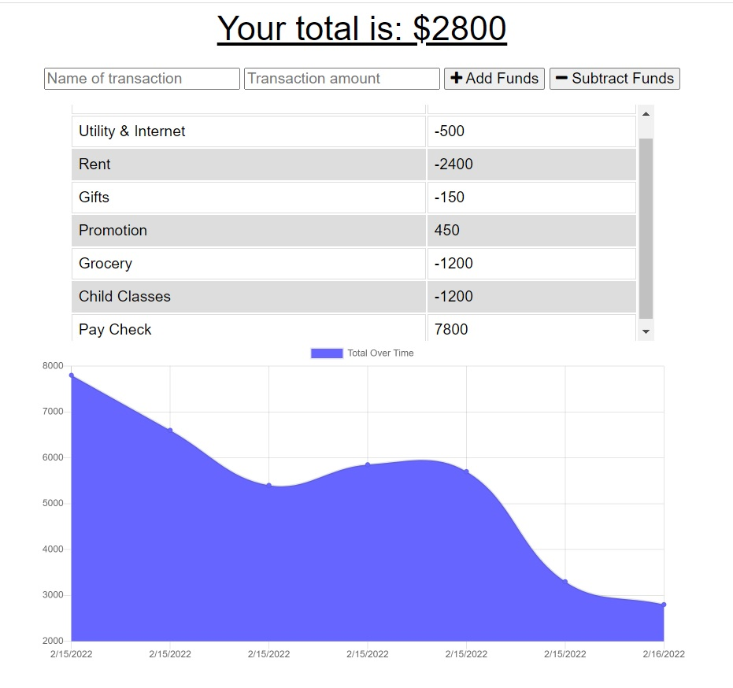

# PWA_BudgeTracker

Progressive Web Applications tracks budget using MongoDB.

## Description

This is a PWA app allows for the input add and subtract funds which are then displayed in table and a graph.

This app uses of indexedDB to add offline functionality. 

A Service Worker also allows as a refresher on how to add this to the application.

Use of web manifest to the application with the app’s metadata, to let users’ devices know what they’re installing and how the app should look on the home screen.

## Usage

Heroku Link: https://mysterious-sea-57565.herokuapp.com/

## Technologies

JavaScript

MongoDB

Node.js

express.js

mongoose

morgan

## Screenshot

 
